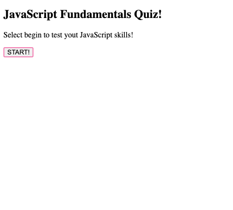

# JavaScriptQuiz

## Description

This JavaScript Basic's Quiz is for users looking to test their knowledge on JavaScript. This project is built to create a space for developers to test and build on their basic understanding of JavaScript. The main goal is to provide randomized questions for users to answer about JavaScript. 

As an aspriring web developer I want to take a quiz to recieve questions about JavaScript so I can maintain and build on my knowledge to further my studies.

## Installation 
N/A

## Usage
When I click the start button on the quiz, then a timer starts and I am presented with a question to answer. When I answer the question, then I will be presented with another question. If I answer a question incorrectly then, time is subtracted from the clock. When, all of the questions are answered or the timer reaches 0, then the game is over. When the game is over, then I can save my initials and my score to the scoreboard. 

## 

## Link 
https://cassiewatsonn.github.io/JavaScriptQuiz/

## Credits 
N/A 

## License

MIT License

Copyright (c) [2023]

Permission is hereby granted, free of charge, to any person obtaining a copy
of this software and associated documentation files (the "Software"), to deal
in the Software without restriction, including without limitation the rights
to use, copy, modify, merge, publish, distribute, sublicense, and/or sell
copies of the Software, and to permit persons to whom the Software is
furnished to do so, subject to the following conditions:

The above copyright notice and this permission notice shall be included in all
copies or substantial portions of the Software.

THE SOFTWARE IS PROVIDED "AS IS", WITHOUT WARRANTY OF ANY KIND, EXPRESS OR
IMPLIED, INCLUDING BUT NOT LIMITED TO THE WARRANTIES OF MERCHANTABILITY,
FITNESS FOR A PARTICULAR PURPOSE AND NONINFRINGEMENT. IN NO EVENT SHALL THE
AUTHORS OR COPYRIGHT HOLDERS BE LIABLE FOR ANY CLAIM, DAMAGES OR OTHER
LIABILITY, WHETHER IN AN ACTION OF CONTRACT, TORT OR OTHERWISE, ARISING FROM,
OUT OF OR IN CONNECTION WITH THE SOFTWARE OR THE USE OR OTHER DEALINGS IN THE
SOFTWARE.